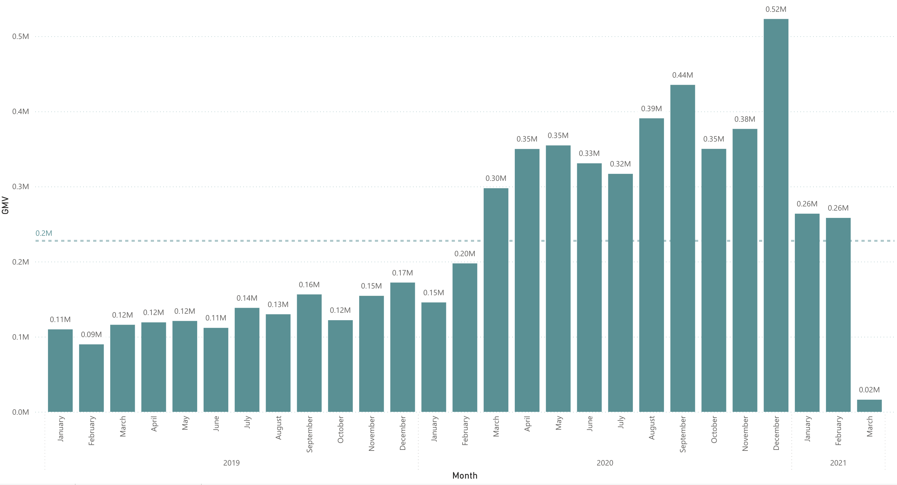
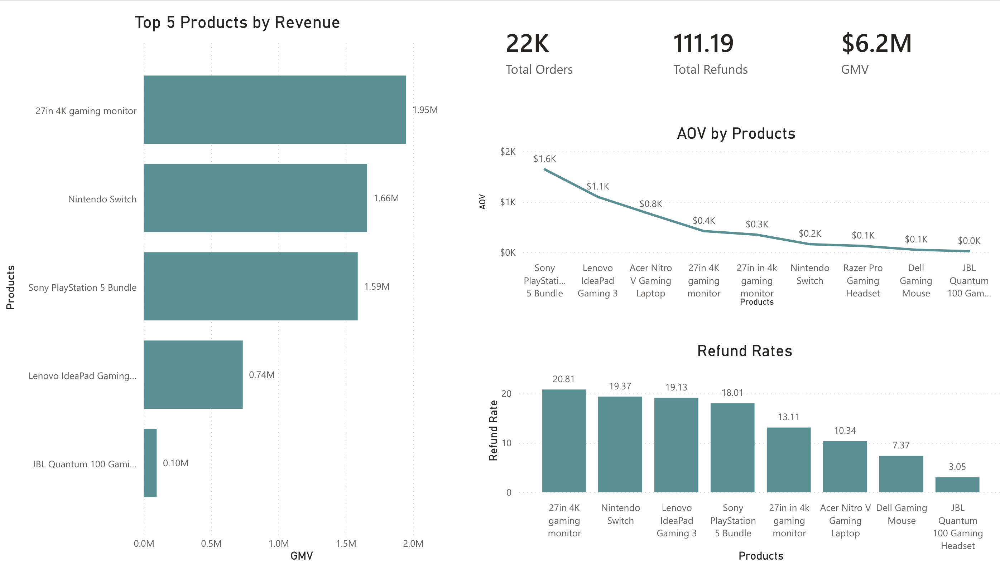
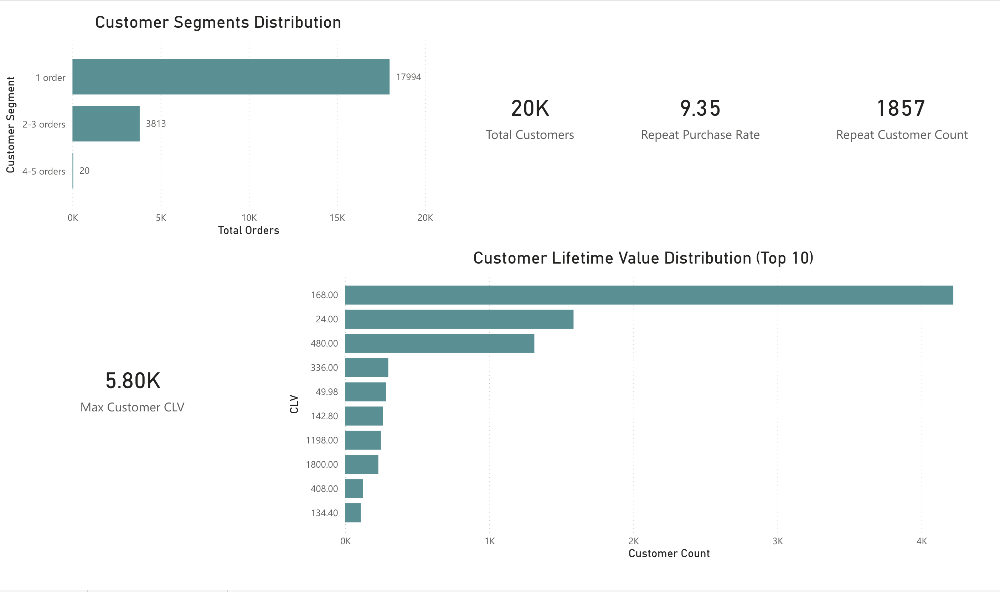
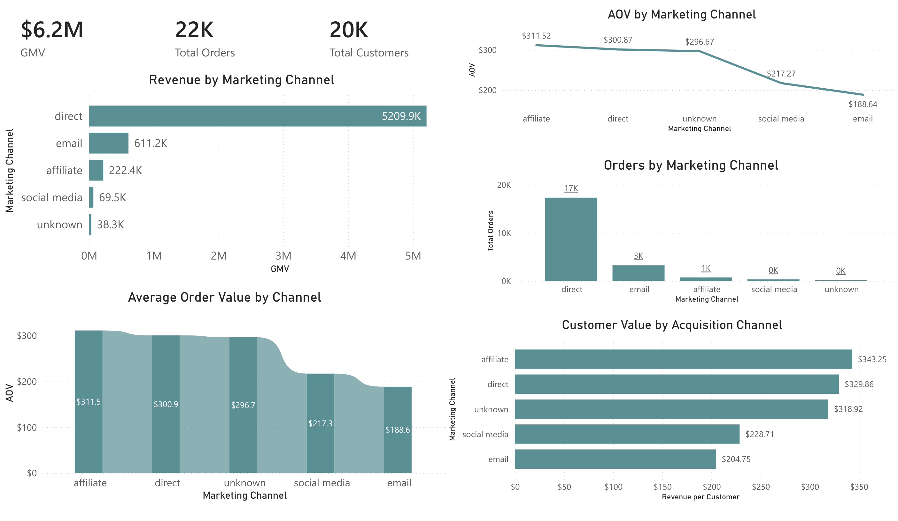
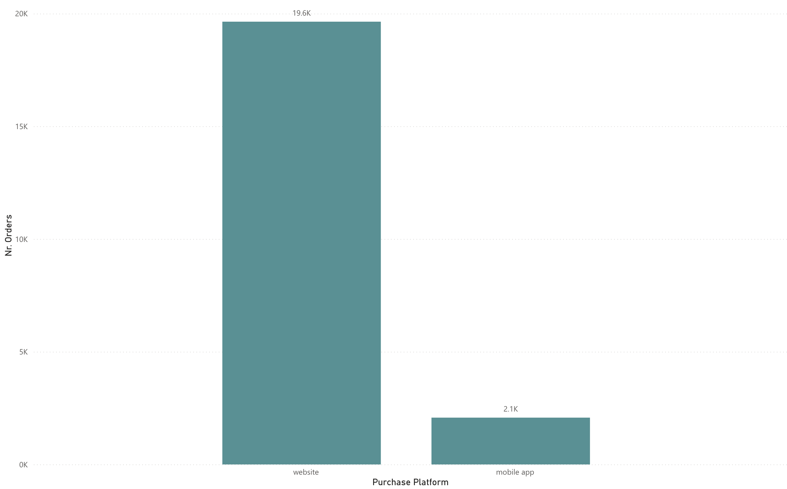
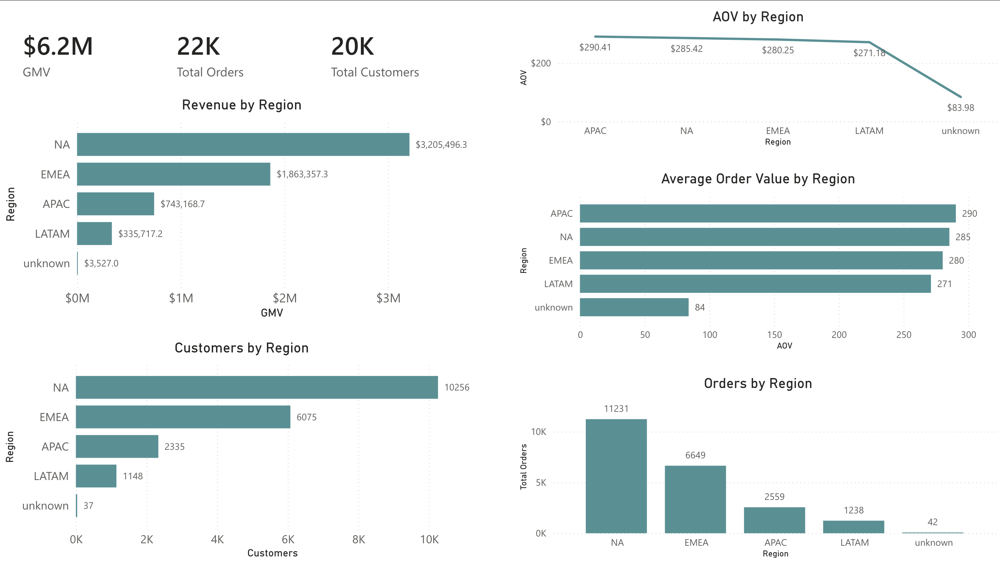

<h1 align="center">🎮 GameZone E-Commerce Performance Analysis (2019–2022)</h1>
<h2 align="center">Executive Summary</h2>

This project analyzes the commercial performance of <strong>GameZone</strong>, a fictional e-commerce retailer specializing in gaming hardware, consoles, and accessories, between <strong>2019 and 2022</strong>. During the analyzed period, the business generated <strong>$6.2M</strong> from <strong>22K orders</strong> placed by <strong>20K customers</strong>, with an <strong>overall company-wide average order value of $283.2</strong>.

At a high level, these numbers indicate strong demand and meaningful commercial scale. However, deeper analysis shows that performance is highly concentrated across a few products, one dominant acquisition channel, a single primary platform, and one leading region. This means the business is growing, but the growth model is not yet fully diversified or resilient.

The sales trend shows a sharp acceleration during the pandemic years, with monthly GMV increasing from roughly <strong>$0.11M–$0.16M in early 2019</strong> to <strong>$0.30M–$0.44M in 2020</strong>, ultimately reaching a peak of <strong>$0.52M</strong>. Product analysis shows that the top 3 products generated approximately <strong>$5.20M</strong>, or about <strong>84% of total GMV</strong>. Customer behavior reveals weak retention, with <strong>17,994 one-time buyers</strong> and a repeat purchase rate of only <strong>9.35%</strong>. Marketing is similarly concentrated, with <strong>Direct</strong> contributing <strong>$5.21M</strong>, or about <strong>84% of total revenue</strong>. Regionally, <strong>North America</strong> leads with <strong>$3.21M GMV</strong>, representing roughly <strong>52% of company revenue</strong>.

Overall, the analysis suggests that GameZone has strong product-market demand and an effective acquisition engine, but long-term growth will depend on improving customer retention, reducing concentration risk, expanding high-value channels, and increasing the efficiency of mobile and regional growth.

<h2 align="center">Live Dashboard</h2>

  <a href="https://app.powerbi.com/view?r=eyJrIjoiYWUxMjhkZmEtYmMxYi00ODc0LWEyOGQtOTRiZjBjYjk0Y2M3IiwidCI6ImEwYzY3MzQ4LTdhYWYtNDE0MC05YzVhLTNhMmUwNmJmMGYwZCIsImMiOjh9">
    View Interactive Power BI Dashboard 📈
  </a>

  

 

<h2 align="center">Project Overview</h2>

<table align="center">
  <thead>
    <tr>
      <th align="center">Category</th>
      <th align="center">Details</th>
    </tr>
  </thead>
  <tbody>
    <tr>
      <td align="center"><strong>Domain</strong></td>
      <td align="center">E-Commerce / Gaming Retail</td>
    </tr>
    <tr>
      <td align="center"><strong>Period</strong></td>
      <td align="center">2019–2022</td>
    </tr>
    <tr>
      <td align="center"><strong>Tools</strong></td>
      <td align="center">PostgreSQL, Excel, Power BI</td>
    </tr>
    <tr>
      <td align="center"><strong>Focus Areas</strong></td>
      <td align="center">Sales, Products, Customers, Marketing, Regions</td>
    </tr>
  </tbody>
</table>

<h2 align="center">Business Objective</h2>

The purpose of this project was to evaluate GameZone’s commercial performance across multiple dimensions and answer the following business questions:

<ul>
  <li>How did revenue evolve between 2019 and 2022?</li>
  <li>Which products generate the majority of sales?</li>
  <li>Is customer growth supported by retention, or mostly by acquisition?</li>
  <li>Which marketing channels generate the most valuable customers?</li>
  <li>How does performance differ across regions and platforms?</li>
</ul>

<h2 align="center">Northstar Metrics</h2>

<table align="center">
  <thead>
    <tr>
      <th align="center">Metric</th>
      <th align="center">Value</th>
      <th align="center">Interpretation</th>
    </tr>
  </thead>
  <tbody>
    <tr>
      <td align="center"><strong>GMV</strong></td>
      <td align="center"><strong>$6.2M</strong></td>
      <td align="center">Demonstrates meaningful commercial scale across the analyzed period.</td>
    </tr>
    <tr>
      <td align="center"><strong>Total Orders</strong></td>
      <td align="center"><strong>22K</strong></td>
      <td align="center">Shows strong transaction volume, but requires retention context to assess sustainability.</td>
    </tr>
    <tr>
      <td align="center"><strong>Total Customers</strong></td>
      <td align="center"><strong>20K</strong></td>
      <td align="center">Large customer base, though order-to-customer ratio suggests limited repeat activity.</td>
    </tr>
    <tr>
      <td align="center"><strong>Overall Company AOV</strong></td>
      <td align="center"><strong>$283.2</strong></td>
      <td align="center">Indicates healthy basket value at company level and supports premium product positioning.</td>
    </tr>
  </tbody>
</table>

  <em>Note:</em> This project distinguishes between <strong>overall company-wide AOV</strong> and <strong>context-specific AOV</strong> by channel, region, and page-level grouping.

<h2 align="center">Sales Performance</h2>

<table align="center">
  <thead>
    <tr>
      <th align="center">Metric</th>
      <th align="center">Value</th>
      <th align="center">Insight</th>
    </tr>
  </thead>
  <tbody>
    <tr>
      <td align="center">Early 2019 Monthly GMV</td>
      <td align="center">$0.11M–$0.16M</td>
      <td align="center">Revenue started from a relatively modest monthly base</td>
    </tr>
    <tr>
      <td align="center">2020 Monthly GMV Range</td>
      <td align="center">$0.30M–$0.44M</td>
      <td align="center">Strong demand acceleration during the pandemic period</td>
    </tr>
    <tr>
      <td align="center">Peak Monthly GMV</td>
      <td align="center">$0.52M</td>
      <td align="center">Peak monthly revenue was more than 3x higher than the weakest visible month</td>
    </tr>
  </tbody>
</table>

<li>GameZone experienced a clear revenue expansion phase between 2019 and 2020. This growth reflects strong demand in gaming-related categories during the pandemic, but the later moderation suggests that not all growth was structurally repeatable. As market conditions normalized, concentration and retention issues became more important to the long-term outlook.</li>

<h2 align="center">Product Performance</h2>

<table align="center">
  <thead>
    <tr>
      <th align="center">Product</th>
      <th align="center">Revenue</th>
      <th align="center">Revenue Share</th>
      <th align="center">Refund Rate</th>
    </tr>
  </thead>
  <tbody>
    <tr>
      <td align="center">27in 4K Gaming Monitor</td>
      <td align="center">$1.95M</td>
      <td align="center">~31%</td>
      <td align="center">20.81%</td>
    </tr>
    <tr>
      <td align="center">Nintendo Switch</td>
      <td align="center">$1.66M</td>
      <td align="center">~27%</td>
      <td align="center">19.37%</td>
    </tr>
    <tr>
      <td align="center">Sony PlayStation 5 Bundle</td>
      <td align="center">$1.59M</td>
      <td align="center">~26%</td>
      <td align="center">18.01%</td>
    </tr>
    <tr>
      <td align="center"><strong>Top 3 Combined</strong></td>
      <td align="center"><strong>$5.20M</strong></td>
      <td align="center"><strong>~84%</strong></td>
      <td align="center"><strong>High refund exposure</strong></td>
    </tr>
  </tbody>
</table>

<h3 align="center">Key Insights</h3>

<ul>
  <li>Revenue is highly concentrated in a very small number of flagship products, with the top 3 products contributing approximately <strong>84%</strong> of total GMV.</li>
  <li>This confirms strong product-market fit, but also exposes the business to significant product-level concentration risk.</li>
  <li>The same high-revenue products also show elevated refund behavior, which reduces revenue quality.</li>
  <li>Some products show refund rates close to <strong>1 in 5 purchases</strong>, suggesting that not all revenue is equally healthy.</li>
  <li>Gross sales alone may overstate the true commercial quality of certain products due to elevated return behavior.</li>
</ul>
<h2 align="center">Customer Analysis</h2>

<table align="center">
  <thead>
    <tr>
      <th align="center">Metric</th>
      <th align="center">Value</th>
      <th align="center">Insight</th>
    </tr>
  </thead>
  <tbody>
    <tr>
      <td align="center">1 Order Customers</td>
      <td align="center">17,994</td>
      <td align="center">Most customers purchase only once</td>
    </tr>
    <tr>
      <td align="center">2–3 Orders Customers</td>
      <td align="center">3,813</td>
      <td align="center">A smaller repeat buyer segment exists</td>
    </tr>
    <tr>
      <td align="center">4–5 Orders Customers</td>
      <td align="center">20</td>
      <td align="center">Highly loyal customers are extremely rare</td>
    </tr>
    <tr>
      <td align="center">Repeat Customers</td>
      <td align="center">1,857</td>
      <td align="center">Low retention footprint overall</td>
    </tr>
    <tr>
      <td align="center">Repeat Purchase Rate</td>
      <td align="center">9.35%</td>
      <td align="center">Roughly 9 out of 10 customers do not return</td>
    </tr>
    <tr>
      <td align="center">Max CLV</td>
      <td align="center">$5.80K</td>
      <td align="center">High-value customers exist, but are limited in number</td>
    </tr>
  </tbody>
</table>

<li>Customer behavior shows that GameZone is significantly stronger at acquisition than retention. The business can attract buyers, but has not yet built a strong repeat-purchase engine. This limits long-term efficiency and makes growth more dependent on continuously bringing in new customers.</li>

<h2 align="center">Marketing Performance</h2>

<table align="center">
  <thead>
    <tr>
      <th align="center">Channel</th>
      <th align="center">GMV</th>
      <th align="center">Orders</th>
      <th align="center">Channel AOV</th>
      <th align="center">Revenue per Customer</th>
    </tr>
  </thead>
  <tbody>
    <tr>
      <td align="center">Direct</td>
      <td align="center">$5.21M</td>
      <td align="center">17.3K</td>
      <td align="center">$300.9</td>
      <td align="center">$329.86</td>
    </tr>
    <tr>
      <td align="center">Email</td>
      <td align="center">$611.2K</td>
      <td align="center">3.2K</td>
      <td align="center">$188.6</td>
      <td align="center">$204.75</td>
    </tr>
    <tr>
      <td align="center">Affiliate</td>
      <td align="center">$222.4K</td>
      <td align="center">0.7K</td>
      <td align="center">$311.5</td>
      <td align="center">$343.25</td>
    </tr>
    <tr>
      <td align="center">Social Media</td>
      <td align="center">$69.5K</td>
      <td align="center">0.3K</td>
      <td align="center">$217.3</td>
      <td align="center">$228.71</td>
    </tr>
    <tr>
      <td align="center">Unknown</td>
      <td align="center">$38.3K</td>
      <td align="center">0.1K</td>
      <td align="center">$296.7</td>
      <td align="center">$318.92</td>
    </tr>
  </tbody>
</table>

<li>Direct is overwhelmingly dominant, contributing approximately <strong>84% of total revenue</strong>. However, smaller channels such as <strong>Affiliate</strong> generate stronger customer value metrics, indicating that the biggest channel is not necessarily the most efficient one.</li>

<h2 align="center">Platform Performance</h2>

<table align="center">
  <thead>
    <tr>
      <th align="center">Platform</th>
      <th align="center">Orders</th>
      <th align="center">Share</th>
    </tr>
  </thead>
  <tbody>
    <tr>
      <td align="center">Website</td>
      <td align="center">19.6K</td>
      <td align="center">~90%</td>
    </tr>
    <tr>
      <td align="center">Mobile App</td>
      <td align="center">2.1K</td>
      <td align="center">~10%</td>
    </tr>
  </tbody>
</table>

<li>The website drives roughly <strong>9x more orders</strong> than the mobile app. This suggests that the web channel is the primary conversion engine, while mobile remains an underdeveloped commercial opportunity.</li>

<h2 align="center">Regional Performance</h2>

<table align="center">
  <thead>
    <tr>
      <th align="center">Region</th>
      <th align="center">GMV</th>
      <th align="center">Orders</th>
      <th align="center">Customers</th>
      <th align="center">Regional AOV</th>
    </tr>
  </thead>
  <tbody>
    <tr>
      <td align="center">NA</td>
      <td align="center">$3,205,496.3</td>
      <td align="center">11,231</td>
      <td align="center">10,256</td>
      <td align="center">285</td>
    </tr>
    <tr>
      <td align="center">EMEA</td>
      <td align="center">$1,863,357.3</td>
      <td align="center">6,649</td>
      <td align="center">6,075</td>
      <td align="center">280</td>
    </tr>
    <tr>
      <td align="center">APAC</td>
      <td align="center">$743,168.7</td>
      <td align="center">2,559</td>
      <td align="center">2,335</td>
      <td align="center">290</td>
    </tr>
    <tr>
      <td align="center">LATAM</td>
      <td align="center">$335,717.2</td>
      <td align="center">1,238</td>
      <td align="center">1,148</td>
      <td align="center">271</td>
    </tr>
    <tr>
      <td align="center">Unknown</td>
      <td align="center">$3,527.0</td>
      <td align="center">42</td>
      <td align="center">37</td>
      <td align="center">84</td>
    </tr>
  </tbody>
</table>

<li>North America is the dominant region, contributing roughly <strong>52% of total GMV</strong>. Regional AOV remains relatively stable across major markets, which suggests that the key difference between regions is not basket value, but overall scale of demand.</li>

<h2 align="center">Cross-Functional Insights</h2>

<table align="center">
  <thead>
    <tr>
      <th align="center">Insight</th>
      <th align="center">Evidence</th>
    </tr>
  </thead>
  <tbody>
    <tr>
      <td align="center">Revenue is highly concentrated</td>
      <td align="center">Top 3 products generate ~84% of GMV</td>
    </tr>
    <tr>
      <td align="center">Acquisition is stronger than retention</td>
      <td align="center">Repeat purchase rate is only 9.35%</td>
    </tr>
    <tr>
      <td align="center">Channel mix is unbalanced</td>
      <td align="center">Direct contributes ~84% of GMV</td>
    </tr>
    <tr>
      <td align="center">Mobile is underutilized</td>
      <td align="center">Website contributes ~90% of orders</td>
    </tr>
    <tr>
      <td align="center">Regional reach is uneven</td>
      <td align="center">North America contributes ~52% of revenue</td>
    </tr>
  </tbody>
</table>

<h2 align="center">Strategic Recommendations</h2>

<table align="center">
  <thead>
    <tr>
      <th align="center">Priority</th>
      <th align="center">Recommendation</th>
      <th align="center">Expected Impact</th>
    </tr>
  </thead>
  <tbody>
    <tr>
      <td align="center">1</td>
      <td align="center">Improve retention through lifecycle campaigns, loyalty programs, and post-purchase engagement</td>
      <td align="center">Increase repeat revenue and customer lifetime value</td>
    </tr>
    <tr>
      <td align="center">2</td>
      <td align="center">Reduce dependence on top products by expanding adjacent categories and bundles</td>
      <td align="center">Lower product concentration risk</td>
    </tr>
    <tr>
      <td align="center">3</td>
      <td align="center">Scale smaller, higher-value channels such as Affiliate</td>
      <td align="center">Improve customer quality and diversify acquisition</td>
    </tr>
    <tr>
      <td align="center">4</td>
      <td align="center">Improve mobile app UX and conversion flow</td>
      <td align="center">Unlock additional orders without relying only on new traffic</td>
    </tr>
    <tr>
      <td align="center">5</td>
      <td align="center">Develop a segmented regional expansion strategy</td>
      <td align="center">Improve penetration outside the top region</td>
    </tr>
  </tbody>
</table>

<h2 align="center">Project Structure</h2>

<pre>
gamezone-ecommerce-performance-analysis/
│
├── data/
│   ├── orders.csv
│   ├── products.csv
│   └── region.csv
│
├── sql/
│   ├── data_cleaning.sql
│   ├── kpi_views.sql
│   ├── product_analysis.sql
│   ├── customer_analysis.sql
│   ├── marketing_analysis.sql
│   └── region_analysis.sql
│
├── dashboard/
│   ├── project.pbix
│   ├── overview.png
│   ├── products.png
│   ├── customers.png
│   ├── marketing.png
│   └── regions.png
│
└── README.md
</pre>

<h2 align="center">Final Conclusion</h2>

<li> GameZone demonstrates strong topline performance, but the analysis shows that this success is built on a narrow set of commercial drivers. </li>
<li> Approximately <strong>84% of revenue</strong> comes from the top 3 products, around <strong>84% from Direct</strong>, roughly <strong>90% of customers buy only once</strong>, about <strong>90% of orders come from the website</strong>, and <strong>North America contributes ~52% of total GMV</strong>. </li>

<li>This means the business has proven demand, but not yet a fully resilient growth model. The next phase of growth should focus on improving retention, diversifying product and channel mix, increasing mobile contribution, and scaling more deliberately across regions.

</li>
